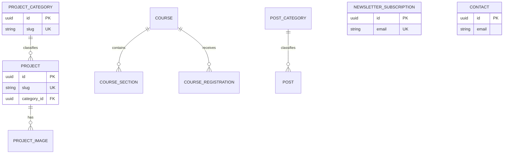

# Backend architecture

```text
HTTP request -> Controller -> Domain service -> PrismaService -> PostgreSQL
PostgreSQL model -> Domain mapper -> camelCase response DTO -> Frontend
```

Controllers only bind validated input and return service output. Domain services own publication rules, lookup, pagination and mutation behavior. Prisma is centralized in the global database module; there is no repository interface without a concrete need.

Structured display-only `highlights` and `sections` are JSON because the public UI consumes them atomically. Categories, galleries, course curriculum and submissions are relational because they have identity, constraints or independent lifecycle.

## ERD



Public queries exclude drafts, archived content and soft-deleted rows. Project images/course sections cascade only with their owning aggregate; deleting a category cannot cascade content.
